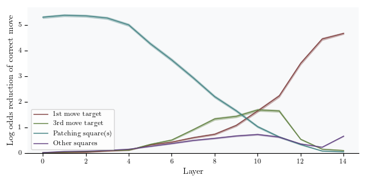
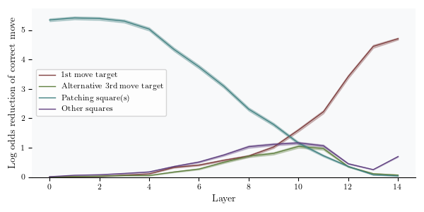
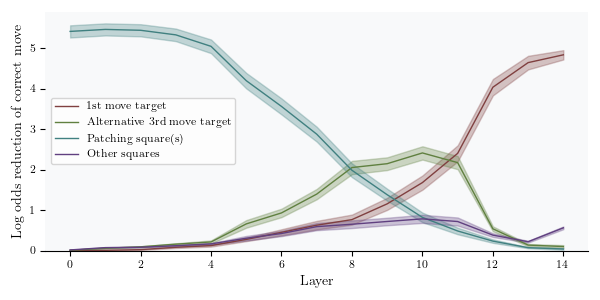
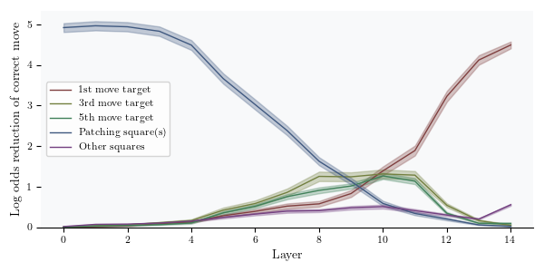
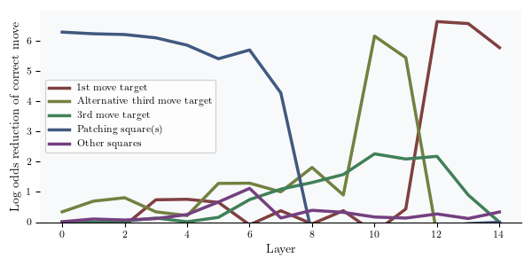

In this fork, I have some work I have done on top of the original repo.

## Move Trees

In the original paper, they focus on showing, in several ways, that the third move is encoded in the state of the network and influences the choice of the first move. To be able to study the role of other future moves, I add a field `"move_tree"` to each puzzle. The move tree is obtained by playing the top _k_ moves at each board, for some depth.

Start
├── e2e4
│   ├── e7e5
│   │   ├── g1f3
│   │   │   ├── b8c6
│   │   │   │   ├── f1b5
│   │   ├── f1c4
│   ├── c7c5
│   │   ├── g1f3
│   └── e7e6
├── d2d4
│   ├── d7d5
│   │   ├── c2c4
│   │   ├── g1f3
│   ├── g8f6
│   │   ├── c2c4
└── c2c4

For practical reasons only some of the paths are added to the puzzle dataframe.
To add move trees run the script "add_move_trees_to_puzzles.py"

## Tags

I add some columns related to how big an impact a given move of the move_tree has on the output (when doing activation patching). They come handy for selecting subsets of the puzzle dataset.
The code is in "add_tags_to_puzzles.py"

# Activation patching

In the paper they show the effect of doing activation patching on some squares at each layer, and show that patching the target of the third move has a very large effect on the output. Only the corrupted square and the target square of the first move have a larger effect.



Where the 3rd move is the 3rd move of the puzzle solution, that in most puzzles is the same move that the network chooses with self-play and choosing the top move at each turn, but not all.

We can try the same thing but with a different future move, for example the 3rd move in the case where the opponent chooses the second option (the move with the second highest score), being careful of choosing only those puzzles where the target of this alternative third move and the main path third move are different.



Even though the effect is not as noticeable as in the previous example, it seems to have an influence as well. Selecting ~500 puzzles where this particular move has a big effect we get:



Under superficial inspection these puzzles seems to be those where the second move doesnt have a clear first choice.

Other future moves show a large effect if we select specific puzzles where they are relevant.



Because all of these plots are the result of averaging over many different puzzles, there are two possible situations. It can be the case that for each board, there is one future move that has most of the influence. And this move (relative to the move tree) is different in each case. It could be the third move, the fifth move, or an alternative path. Or the other option, for a single board, several future moves have a sizeable effect on the output. For the puzzle with id "0NVfF" for example, we observe:



# Head 12, layer 12

In the paper they observe that this head often has a large entry for the attention pattern with the first move target as query and the third move target as key. In ~30% of the puzzles it is the biggest entry.

So do other future moves also have a large value in the attention pattern of this head?

Keeping the first move target as query, and looking in puzzles where these moves have a different target square than the main path third move (although not necessarily different between them):

- The fifth move is the largest entry in ~10% of puzzles.
- The alternative third move (choosing the 2nd option of the 2nd move) is the largest entry in ~10% of puzzles.

However if we focus on ~300 puzzles where this moves have big effects in activation patching, the percentange increases to >30% in both cases. So this head seems to attend to future moves when they are more relevant.

# Probing

I repeat the paper probing experiments, but with other movements of the move tree. 


# Evidence of Learned Look-Ahead in a Chess-Playing Neural Network

[**Project page**](https://leela-interp.github.io/) | [**Paper**](https://arxiv.org/abs/2406.00877)

## Setup

```
pip install -e .
```

Download the files from https://figshare.com/s/adc80845c00b67c8fce5 into your
working directory. (`lc0.onnx` and `interesting_puzzles.pkl` are required for most
experiments, `lc0-random.onnx` is only required for the probing baseline,
and `LD2.onnx` and `unfiltered_puzzles.pkl` are only required if you want to explore
other ways to filter or corrupt puzzles).

## Reproducing results

If you want to regenerate the puzzle dataset, follow these steps:
- Download `lichess_db_puzzle.csv.zst` from https://database.lichess.org/#puzzles.
  Then decompress using `zstd -d lichess_db_puzzle.csv.zst`.
- Run `scripts/make_puzzles.py --generate` to generate the puzzle dataset.
- Run `scripts/make_corruptions.py` to add corruptions to puzzles.

Alternatively, you can use the `interesting_puzzles.pkl` file we provide.

Then compute the raw results using the other scripts:
- For probing results, run `scripts/probing.py --main --random_model --n_seeds 5`
  (leave out `--random_model` if you don't want to run the baseline with probes trained
  on a randomly initialized model). You can use more or fewer seeds of course.
  Note that this requires around 70GB or RAM to store activations. You can
  alternatively store those activations on disk (see the source code of the script)
  or reduce the number of puzzles that are used with `--n_puzzles`.
- To get residual stream and attention head activation patching results, run
  `scripts/run_global_patching.py --residual_stream --attention`
- To reproduce the L12H12 results, run `scripts/run_single_head.py --main`. You can also
  study other heads with `--layer` and `--head`, and do additional ablations with
  `--squarewise` and `--single_weight`, as well as cache the attention pattern with
  `--attention_pattern`. None of these are necessary to reproduce the paper results.
- For piece movement head results, run `scripts/piece_movement_heads.py`.

Results will be stored in `results/`. Each script takes an `--n_puzzles` argument which
you can use to limit the number of puzzles to run on. You can often also specify
`--batch_size` and other arguments (in particular, you might want to set `--device`,
which defaults to `cuda`). Each script should run in at most a few hours on a
fast GPU like an A100.

Then use the `other_figures.ipynb` notebook to create most of the figures and other
analyses based on these results. `act_patching.ipynb`, `puzzle_example.ipynb`, and
`figure_1.ipynb` create Figures 1-3 with their illustrations.

Note that the notebooks assume the working directory is the root directory of this
repository (or whereever else the `lc0.onnx`, `interesting_puzzles.pkl`, and
`results/*` files are stored). You can set this in VS Code with
```json
{
    "jupyter.notebookFileRoot": "/path/to/dir"
}
```

## Using the codebase for follow-up work
We recommend you start by taking a look at `notebooks/demo.ipynb`, which shows how to
use some of the features of this codebase. From there, you can start exploring how the
scripts and the main `leela_interp` package work.

The `leela_interp` package has two subpackages: `leela_interp.core` and
`leela_interp.tools`. The `core` package contains infrastructure and general-purpose
utilities that will likely be useful whatever you do. The `tools` package is much more
optional---it contains code that we used or our experiments (e.g. probing),
but it might not suit your needs.

## Known issues
We've observed `NaN` outputs for Leela on MPS sometimes (but never on CPU or CUDA).

# Citation
If you find this codebase helpful for your research, please cite our paper:

```
@misc{jenner2024evidence,
      title={Evidence of Learned Look-Ahead in a Chess-Playing Neural Network}, 
      author={Erik Jenner and Shreyas Kapur and Vasil Georgiev and Cameron Allen and Scott Emmons and Stuart Russell},
      year={2024},
      eprint={2406.00877},
      archivePrefix={arXiv},
      primaryClass={cs.LG}
}
```
